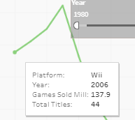
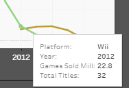
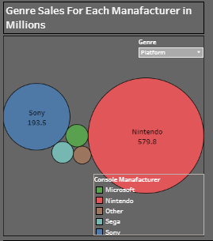
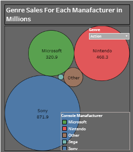
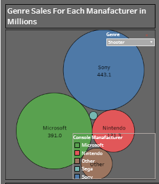

Common Trends Between Nintendo Platforms
================
Steven Hernandez
2023-03-30

Website: https://stevenh825-git.github.io/Nintendo-Console-Sales/

Nintendo’s intellectual properties (IP) have allowed the company to
became a household name.

- People from multiple generations recognize *Mario* or *Pokemon*.

However, the company had under-performing consoles in the past. For that
reason, viewing the sales data for Nintendo’s consoles will provide an
understanding of the patterns shared across multiple platforms. In
addition, these patterns may provide key insight when purchasing a
Nintendo console for the consumer.

## Understanding the Data

### Set Up Workspace

- First step is to include the libraries that will be useful for our
  analysis.

``` r
library('tidyverse')
library('skimr')
library('janitor')
library('ggplot2')
```

### Structure

- The data set used for this analysis is from
  [Kaggle](https://www.kaggle.com/datasets/kabhishm/best-selling-nintendo-switch-video-games).

``` r
switch_sales <- read_csv('best_selling_switch_games.csv')
```

To see what the data set contains:

``` r
#Obtain info on its structure, columns, etc.
glimpse(switch_sales)
```

    ## Rows: 73
    ## Columns: 8
    ## $ title        <chr> "Mario Kart 8 Deluxe", "Animal Crossing: New Horizons", "…
    ## $ copies_sold  <dbl> 48410000, 40170000, 29530000, 27790000, 25370000, 2440000…
    ## $ genre        <chr> "Kart racing", "Social simulation", "Fighting", "Action-a…
    ## $ developer    <chr> "Nintendo EPD", "Nintendo EPD", "Bandai Namco StudiosSora…
    ## $ publisher    <chr> "Nintendo", "Nintendo", "Nintendo", "Nintendo", "The Poké…
    ## $ as_of        <date> 2022-09-30, 2022-09-30, 2022-09-30, 2022-09-30, 2022-09-…
    ## $ release_date <date> 2017-04-28, 2020-03-20, 2018-12-07, 2017-03-03, 2019-11-…
    ## $ IP           <chr> "Mario", "Animal Crossing", "Other", "Zelda", "Pokemon", …

This data set is filled with **73 Switch games** that have sold **at
least 1 million copies**.

- This data set may be used to investigate:
  - Most popular titles
  - Preferred genres
  - Highest grossing franchises

## 

## Switch’s Sales By Genre

- First, it is important to view the genres with the most games selling
  over 1 million copies.

``` r
# Look at the most popular 10 genres
head(grouped_genre,10)
```

    ## # A tibble: 10 × 2
    ##    Genre                            count
    ##    <chr>                            <int>
    ##  1 Platformer                           7
    ##  2 Role-playing                         7
    ##  3 Action role-playing                  6
    ##  4 Fighting                             6
    ##  5 Action-adventure                     5
    ##  6 Party                                4
    ##  7 Sports                               4
    ##  8 Action-adventure, Hack and Slash     2
    ##  9 Exergame, Rhythm                     2
    ## 10 Puzzle                               2

- Since the genres after the 7th row are 2 games or less, they are
  omitted from the following graph.

## {.tabset}

### Graph

<!-- -->

- The graph showcases that **platformers** and **role-playing games**
  are the Switch’s most popular genres.

### Code

    min_date = min(switch_sales$release_date)
    max_date = max(switch_sales$release_date)


    ggplot(data = top_genres, aes(x  =reorder(Genre,-count), y = count)) +
      geom_bar(stat= 'identity',mapping = aes(fill= Genre)) +
      labs(title = 'Top 7 Switch Genres', subtitle = 'Amount of Games with Over 1 Million Copies Sold',
           y = "Number of Games",
           x = "Genre",
           caption = paste0("Switch Games From: ", min_date, " to ", max_date)) +
      theme(axis.text.x = element_text(size = 10, angle = 45, hjust = 1),
            legend.position = 'None',        
            panel.background = element_rect(fill="#ebf2ff"),
            legend.background = element_rect(fill="#ebf2ff"),
            plot.background = element_rect(fill="#ebf2ff")) +
      geom_text(aes(label = count, fontface= 'bold'),vjust = 1)

## Switch Games Split By Year

Note: This graph will showcase the amount of titles per year that have
sold at least 1 million copies.

## 

### Pie Chart

<!-- -->

### Code


    # Year Pie Chart

    ggplot(data = grouped_year,aes(x = "",y = num_of_titles, fill = year)) +
      geom_bar(stat = 'identity', color = 'black') +
      geom_text(aes(x = 1.7,label = year), 
                position = position_stack(vjust = 0.5)) +
      geom_text(aes(label = num_of_titles), 
                position = position_stack(vjust = 0.5)) +
      coord_polar(theta = 'y') +
      theme(axis.title = element_blank(),
            axis.text = element_blank(),
            axis.ticks = element_blank(),
            legend.position= 'None',
            panel.background = element_rect(fill=("#ebf2ff")),
            legend.background = element_rect(fill="#ebf2ff"),
            plot.background = element_rect(fill="#ebf2ff"),
            plot.caption.position = 'plot') +
      labs(title = "Amount of Switch Games Selling Over 1 Million", subtitle='Split By Year',
           caption = paste0("Switch Games From: ", min_date, " to ", max_date)) 

## 

As a result, the Nintendo Switch is actually fairly consistent in the
quantity of games achieving that milestone.

- However, 2022 is the exception with only 8 games

Even though 2022 contained less games selling over 1 million copies,
those 8 games might have sold more individually than titles from
previous years.

**DATA SET LIMITATIONS**

- Not including Black Friday 2022 or Christmas 2022, the data will be
  skewed against that year

  - Key moments where more games could have reached over 1 Million
    copies sold

## Switch Yearly Performance

Note: This graph will investigate the sales within each year. However,
like the chart prior, the limitations of the data will affect the
results.

- Data is limited to games selling over 1 million copies

  - Missing hundreds of games that sold less.

- Unclear whether 2022 has actually sold as poorly as it did.

Yet, understanding a franchise’s contribution towards the Switch’s
yearly sales can provide insight on the console’s overall success.

## 

### Bar Chart

<!-- -->

### Code

    grouped_year_ip <- year_added %>% 
      group_by(year,Ip) %>% 
      summarize(Units_Sold_Year = sum(Units_Sold_Mill), Avg_Sales = mean(Units_Sold_Mill))

    # Stacked Bar Graph

    ggplot(data = grouped_year_ip, aes(x = year, y = Units_Sold_Year)) +
      geom_bar(stat = 'identity', aes(fill = Ip)) +
      labs(title = "Switch Game Sales By Year",
           subtitle = "Split By Nintendo Properties",
           y = "Total Game Sales") +
      theme(panel.background = element_rect(fill ='#BFDEDF',),
            legend.background = element_rect(fill ='#BFDEDF'),
            plot.background = element_rect(fill ='#BFDEDF'))

## 

- Nintendo’s IPs are generating less titles far exceeding 1 million
  copies sold

  - The Switch is in a steady decline in sales

However, this doesn’t mean that the Switch is performing poorly.

- 2022 sold at least 40 million copies

- Only 8 titles in the data set

- Excluding 2022’s holiday season

Additionally, the lack of a big Mario title for 2022 has seemingly
affected sales.

- *Super Mario Odyssey* in 2017 greatly boosted the sales for that given
  year

## Franchise Sales

Note: Understanding how each Nintendo property performed in a given year
will allow for a better understanding of a year’s total sales.

## 

### Franchise Sales Chart

<!-- -->

### Code

    # Line Graph IP's yearly sales

    ggplot(data = grouped_year_ip) +
      geom_point(aes(x = year, y = Units_Sold_Year)) +
      geom_line(aes(x = year, y = Units_Sold_Year, group = Ip, color = Ip)) +
      facet_wrap(~Ip,scales = 'free') +
      scale_y_continuous(limits= c(0,75))+
      labs(title = "Yearly Sales For Nintendo Properties",
           subtitle = "2017- 2019",y = "Sales (Millions)") +
      theme(plot.background = element_rect(fill ='#BFDEDF'), 
            legend.background = element_rect(fill ='#BFDEDF'),
            legend.position = 'None')

## 

As a result, the trends of Nintendo franchises are shown.

For example, Mario’s explosive sales in 2017 was because of the release
of *Super Mario Odyssey* (\~24 Million), *Mario Kart 8 Deluxe* (\~48
Million), and *Mario + Rabbids Kingdom Battle* (\~2 Million). Meanwhile,
in 2022 there was only *Mario Strikers: Battle League* (\~2 Million).

On the other hand, Animal Crossing in 2022 had a title named *Animal
Crossing: New Horizons* (\~40 Million).

- Explosive popularity may stem from the pandemic

- Greater Switch sales when people were quarantined

Lastly, Pokemon in 2017 saw smaller sales

- 2017 only saw the release of the spin-off title *Pokken Tournament DX*
  (\~1.5 Million)

Meanwhile, the series saw spikes in sales whenever mainline titles
released, such as:

- *Pokemon Sword and Shield* (\~25 Million) in 2019
- *Pokemon Brilliant Diamond and Shining Pearl* (\~15 Million) in 2021
- *Pokemon Legends: Arceus* and *Pokemon Scarlet and Violet* in 2022.

Therefore, these sale figures help highlight the importance of Nintendo
IPs towards the Switch’s performance for a given year.

However, how does the Switch compare to other consoles?

# Tableau Dashboard For Console Statistics

Note: The following dashboard uses data obtained from
[Kaggle](https://www.kaggle.com/datasets/gregorut/videogamesales)


<div id="viz1680029445527" class="tableauPlaceholder"
style="position: relative">

<noscript>
<a href='#'>
</a>
</noscript>
<object class="tableauViz" style="display:none;">
<param name='host_url' value='https%3A%2F%2Fpublic.tableau.com%2F' />
<param name='embed_code_version' value='3' />
<param name='site_root' value='' />
<param name='name' value='NewWorkbook_16796688413350&#47;Dashboard3' />
<param name='tabs' value='yes' /> <param name='toolbar' value='yes' />
<param name='static_image' value='https:&#47;&#47;public.tableau.com&#47;static&#47;images&#47;Ne&#47;NewWorkbook_16796688413350&#47;Dashboard3&#47;1.png' />
<param name='animate_transition' value='yes' />
<param name='display_static_image' value='yes' />
<param name='display_spinner' value='yes' />
<param name='display_overlay' value='yes' />
<param name='display_count' value='yes' />
<param name='language' value='en-US' />
</object>

</div>


There are key takeaways from this dashboard:

## Top Selling Games

Firstly, the top 10 selling games for each console help indicate the
console’s success.

- The Wii’s bestselling game *Wii Sports* (\~82 Million) has sold more
  units than the top 10 games of the WiiU combined.

- Highlighting the Wii’s astronomical success and WiiU’s failure


When comparing Nintendo’s home consoles with Sony’s:

- Sony’s home consoles’ top 10 games combined sales are greater

  - The Wii and NES are exceptions

- Nintendo completely dominates the handheld market.


When investigating the top 10 games for Nintendo consoles, the
franchises represented are usually Nintendo’s major IPs.

- *Mario* contains three titles in the top 10 games for the Wii:
  1.  *Mario Kart Wii* (\~35 Million Sales, Ranking \#2)
  2.  *New Super Mario Bros. Wii* (\~28.62 Million Sales, Ranking \#5)
  3.  *Super Mario Galaxy* (\~11.52 Million Sales, Ranking \#9).

Even Nintendo’s weaker-selling consoles share this behavior.

- The Nintendo GameCube’s top-selling games include:
  1.  *Mario Kart: Double Dash!!* (\~6.95 Million Sales, Ranking \#2)
  2.  *Super Mario Sunshine* (\~6.31 Million Sales, Ranking \#3)
  3.  *Luigi’s Mansion* (\~3.6 Million Sales, Ranking \#5)

This is *similar* behavior to the Nintendo Switch

- Nintendo’s franchises garner the largest sales for the console

## Yearly Sales

The Nintendo Switch saw a consistent quantity of games reaching the 1
Million benchmark from 2017-2021.

Therefore, it is important to see how Nintendo’s other home consoles
perform across their lifespan.


The chart indicates a similar behavior across all platforms.

- Each of the consoles experiences an overall **increase** in sales for
  the **first few years**

- Experiences a **decrease** in sales over time.

The console with the biggest dip is the Nintendo Wii:

## 

### Wii’s Starting Sales



### Wii’s Drop in Sales



## 

- Wii saw over 100 million sales in 2006
- 22 Million sales in 2012

The Nintendo Switch is about seven years old in 2023, so it is perhaps
natural the Switch is experiencing a lower quantity of games selling
over 1 million.

**Similar** behavior can be seen across competitive console
manufacturers:

## 

### Microsoft Sales


### Sony Sales


### Sega Sales


## 

Note: Consoles experience the biggest dip in sales when a new console
has arrived in the market.

- However, have already experienced their peak in sales years before the
  next console’s release.

## Genre

Lastly, different console manufacturers experience greater sales
depending on the genre.


Nintendo consoles have greater sales when the genre is a *platformer*.

- This correlates to the Wii’s and Switch’s top-selling games including
  *Mario*

On the other hand, Sony’s action games sell extraordinarily well, while
Microsoft’s shooters are the biggest genre for their platform.

A possible explanation is the consumer’s perception of these platforms.

- Customers purchase a Nintendo console with the intent to play
  platformers
- A Sony console owner intend to play Sony’s action games.

## 

### Platformer Sales



### Action Sales



### Shooter Sales



## 

## Conclusion

The data from Kaggle for different consoles highlighted behavioral
trends.

- Nintendo consoles, the Switch included, are favorable towards
  platformers
- Other competitors have different genres where the sales are highest
- Nintendo properties, like *Mario* and *Pokémon* perform well.
- Consoles tend to rise in sales for a few years, but then see a dip.
  - Most notably when a new console is released.

With this analysis, consumers would be able to understand what genres
and franchises are most prominent when purchasing a Nintendo Switch. In
addition, highlighting the behavior trends across all Nintendo platforms
provides foresight for Nintendo’s next console.

However, the limitation of the data means further analysis is required.

Limitations:

- The lack of 2022 Holiday Sales
- Switch games selling under 1 Million copies
- 2023 sales

Further analysis may provide better insight on sales trends for the
Nintendo Switch and the customer’s perception of these companies.
